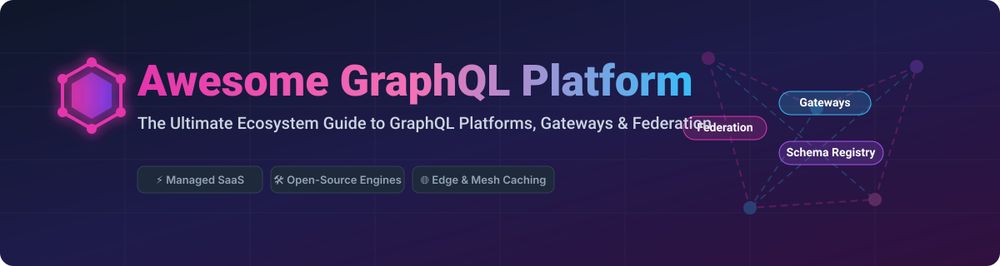

# 🚀 Awesome GraphQL Platform Ecosystem 🌐

  
  
  
  

## 📌 Ecosystem Overview & Architecture

A curated, comprehensive guide and directory of modern **GraphQL Platforms**, **Federation Engines**, **Schema Registries**, **GraphQL Gateways**, **Instant Database API Generators**, **Edge Caching**, and **Observability Tools** for enterprise platform teams and API engineers.

> ⚡ **GraphQL Ecosystem Insights**: Whether building multi-service supergraphs with **Apollo Federation** & **WunderGraph Cosmo**, generating instant GraphQL APIs with **Hasura**, or self-hosting production schema control planes using **GraphQL Hive**, this list provides structured operational metrics, valuation/company scale estimates, exact starting pricing, free tier thresholds, and GitHub community stats.

---

## 📑 Table of Contents

- [📊 Market Landscape & Industry Dynamics](#-market-landscape--industry-dynamics)
- [☁️ SaaS & Hosted GraphQL Platforms](#%EF%B8%8F-saas--hosted-graphql-platforms)
- [🛠️ Open-Source GitHub Projects](#%EF%B8%8F-open-source-github-projects)
- [💡 Architectural Patterns & Recommendations](#-architectural-patterns--recommendations)
- [🤝 How to Contribute](#-how-to-contribute)
- [💖 Support & Community](#-support--community)
- [⚠️ Disclaimer](#%EF%B8%8F-disclaimer)
- [📈 Star History](#-star-history)

---

## 📊 Market Landscape & Industry Dynamics

The estimated global market size for API Management and GraphQL Platform infrastructure is **$5.2 Billion USD**, projecting rapid expansion at ~28% CAGR driven by enterprise microservices adoption and federated data graphs. The GraphQL sector is **moderately fragmented**: anchor pioneers (Apollo GraphQL) lead supergraph federation standards, while database-to-GraphQL generators (Hasura), headless CMSs (Hygraph), and specialized edge/router vendors (WunderGraph, Stellate, The Guild) capture focused architectural niches.

---

## ☁️ SaaS & Hosted GraphQL Platforms

Below is a curated comparison of leading commercial managed GraphQL cloud platforms, sorted by **estimated company scale / valuation / annual revenue** (descending).

| 🏢 Platform / SaaS Product | ℹ️ Description & Key Capabilities | 💰 Pricing Tier | 🎁 Free Tier / Trial Limits | 📈 Company Scale (Valuation / Revenue) |
| :--- | :--- | :--- | :--- | :--- |
| 🚀 **[Apollo GraphOS](https://www.apollographql.com/graphos)** | Managed GraphQL federation platform with schema registry, Studio collaboration, router runtime, supergraph management, & enterprise governance. | **$29/month** (Serverless Team tier) | **Free Plan**: 10 Million Operations / month + unlimited schema checks. | **~$1.5B Valuation** ($130M+ raised, Unicorn status) |
| ⚡ **[Hasura Cloud](https://hasura.io/)** | Instant GraphQL & REST APIs over Postgres/SQL databases with row-level authorization, event triggers, & federated data delivery. | **$99/month** (Professional tier includes 20GB data pass-through) | **Free Plan**: 3 Projects, 100K requests/month, 1GB data transfer/month. | **~$1.0B Valuation** ($100M Series C, Unicorn status) |
| 🌐 **[StepZen (IBM)](https://www.ibm.com/products/stepzen)** | GraphQL federation & API composition platform for building unified graphs over REST, SOAP, database, & microservice backends. | **$0.008/request** (~$80/10M requests on pay-as-you-go) | **Free Trial**: 30-Day trial with unlimited local schemas & cloud deployment limits. | **Acquired by IBM** ($130B+ IBM Market Cap parent) |
| 📰 **[Hygraph](https://hygraph.com/)** | Headless Content Platform (formerly GraphCMS) with native federated GraphQL content API for content-driven web & mobile apps. | **$399/month** (Self-service Professional tier) | **Free Forever Plan**: 3 project environments, 5 seats, 100K operations/month. | **~$50M - $100M Valuation** ($30M+ total funding raised) |
| 🎯 **[Stellate](https://stellate.co/)** | Purpose-built edge GraphQL caching, rate limiting, security, & global analytics platform to reduce origin server load. | **$99/month** (Growth tier with edge caching) | **Free Plan**: 5 Million requests/month + 10GB edge bandwidth included. | **~$30M - $50M Valuation** ($6.2M Seed funding raised) |
| 🐙 **[GraphQL Hive Cloud](https://the-guild.dev/graphql/hive)** | Managed schema registry, usage analytics, schema breaking-change detection, & Apollo Federation gateway service by The Guild. | **$10/month** (Pro plan baseline + usage) | **Free Plan**: 1 Million operations/month + 100K schema checks/month. | **Bootstrapped / Independent** (~$2M - $5M ARR scale) |
| 🗄️ **[Dgraph Cloud](https://dgraph.io/)** | Fully-managed distributed graph database with native GraphQL schema support, ACID transactions, & instant endpoints. | **$29/month** (Flexible backend cloud tier) | **Free Plan**: 1 Shared cluster with 1MB storage & community support. | **~$20M - $40M Valuation** ($11.5M+ total venture funding) |
| 🧱 **[8base](https://www.8base.com/)** | Low-code Backend-as-a-Service (BaaS) with auto-generated GraphQL APIs, data modeling, role permissions, & serverless functions. | **$25/month** (Developer plan) | **Free Plan**: 1 Project, 1 User seat, 500 database rows, 2,500 requests/month. | **~$10M - $25M Valuation** ($6M+ funding raised) |
| 🔮 **[WunderGraph Cosmo Cloud](https://wundergraph.com/)** | High-performance open federation platform with managed schema registry, analytics control plane, & ultra-fast Rust router. | **$25/month** (Pro team baseline) | **Free Plan**: 1 Million operation traces/month + 1 project & unlimited subgraphs. | **Seed Stage / Venture Backed** (~$3M - $10M Valuation scale) |

---

## 🛠️ Open-Source GitHub Projects

Explore top production-ready open-source engines, GraphQL servers, federation gateways, schema registries, and developer tools. Sorted by **GitHub Stars_Count** (descending).

| 📦 Open-Source Project | 🌟 GitHub_Stars | 📜 License | ℹ️ Description & Architectural Role |
| :--- | :--- | :--- | :--- |
| ⚡ **[Hasura GraphQL Engine](https://github.com/hasura/graphql-engine)** |  | Apache-2.0 | Blazing-fast engine that connects to databases (Postgres, MySQL, SQL Server, Snowflake) and instantly exposes a secure GraphQL API. |
| 🚀 **[Apollo Server](https://github.com/apollographql/apollo-server)** |  | MIT | The industry-standard spec-compliant JavaScript/TypeScript GraphQL server for standalone APIs or federated subgraphs. |
| 🗄️ **[Dgraph Core](https://github.com/dgraph-io/dgraph)** |  | Apache-2.0 / BSL | Open-source distributed transactional graph database with native GraphQL schema ingestion and query runtime in Go. |
| 🕸️ **[GraphQL Engine (GraphQL-JS)](https://github.com/graphql/graphql-js)** |  | MIT | The reference JavaScript implementation of the GraphQL specification, serving as the core parsing & execution engine for Node. |
| 🔀 **[GraphQL Mesh](https://github.com/ardatan/graphql-mesh)** |  | MIT | Powerful API composition framework that converts REST, OpenAPI, gRPC, SOAP, and SQL databases into a unified GraphQL gateway. |
| 🧘 **[GraphQL Yoga](https://github.com/dotansimha/graphql-yoga)** |  | MIT | Fully-featured, lightweight, and high-performance cross-platform GraphQL server (runs on Node.js, Deno, Cloudflare Workers, Bun). |
| 🛠️ **[GraphQL Code Generator](https://github.com/dotansimha/graphql-code-generator)** |  | MIT | CLI tool that generates TypeScript types, React Hooks, Apollo Client/urql queries, and backend resolver signatures directly from schemas. |
| 📈 **[GraphQL Hive](https://github.com/kamilkisiela/graphql-hive)** |  | MIT | Complete open-source cloud & self-hosted GraphQL schema registry, breaking-change checker, and supergraph performance analytics platform. |
| 🚀 **[Apollo Router Core](https://github.com/apollographql/router)** |  | ELv2 | High-performance, low-latency GraphQL Federation 2 supergraph gateway written in Rust. |
| ⚡ **[Mercurius](https://github.com/mercurius-js/mercurius)** |  | MIT | Extremely fast GraphQL adapter for Fastify, featuring built-in federation support, loader batching, and query caching. |
| 🔮 **[WunderGraph Cosmo](https://github.com/wundergraph/cosmo)** |  | Apache-2.0 | Complete open-source Apollo Federation v1/v2 compatible solution comprising a schema registry, router (Go/Rust), and studio dashboard. |

---

## 💡 Architectural Patterns & Recommendations

### 🏗️ Self-Hosted Open-Source Supergraph Stack
1. **Subgraphs**: Define your service domain schemas using **GraphQL Yoga** or **Apollo Server**.
2. **Schema Control Plane**: Register and check schemas with self-hosted **GraphQL Hive** or **WunderGraph Cosmo**.
3. **Gateway Router**: Deploy **Apollo Router** or **Hive Gateway / Cosmo Router** to compose and route subgraphs at sub-millisecond edge speed.
4. **Edge Security**: Enforce query complexity caps, depth limiting, and caching via **Stellate** or reverse proxy.

---

## 🤝 How to Contribute

Contributions are welcome! Please follow these simple guidelines:

1. Fork this repository.
2. Update or add new entries to [README.md](file:///C:/Users/ishan/Documents/Projects/Awesome-Graphql-Platform/README.md) following the tabular schema.
3. Ensure exact pricing, free tier limits, Stars_Badges, and factual descriptions are supplied.
4. Open a Pull Request!

Also check out curated awesome resources at [Awesome-Awesome-Awesome](https://github.com/ishandutta2007/Awesome-Awesome-Awesome).

---

## 💖 Support & Community

If you find this GraphQL platform repository useful:
- ⭐ **Star** this repo to help others discover it!
- 🔀 **Fork** and share with your API design & platform teams.
- 💬 Join our developer discussions on [Discord](https://discord.gg/jc4xtF58Ve).
- ☕ **Sponsor & Buy a Coffee**: Support ongoing open-source maintenance via [GitHub Sponsors](https://github.com/sponsors/ishandutta2007).

---

## ⚠️ Disclaimer

- This is a community-curated directory — not an official endorsement.
- SaaS platform pricing and free tier specs reflect published baseline plans as of late 2026.
- Always perform internal security assessments for schema exposure, authentication, and gateway limits before deploying GraphQL to production.

---

## 📈 Star History

